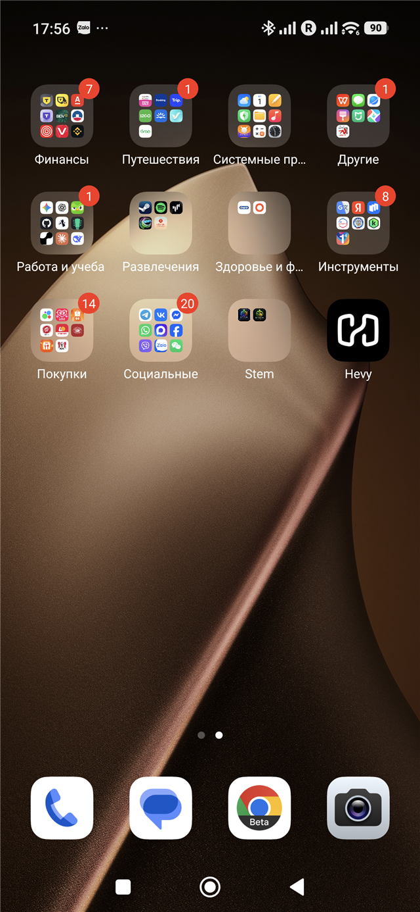

# S.T.E.M. Training

Native Android gym diary built with Kotlin, Jetpack Compose, Material 3, and Room.



## Install

Open [GitHub Releases](https://github.com/Tellraxoid/G-man/releases), download the attached `STEM-Training-*.apk`, and open it on Android. Allow installation from your browser or file manager when prompted.

## Build and test

```powershell
.\gradlew.bat testDebugUnitTest assembleDebug
```

Package: `com.stem.stemtraining`
